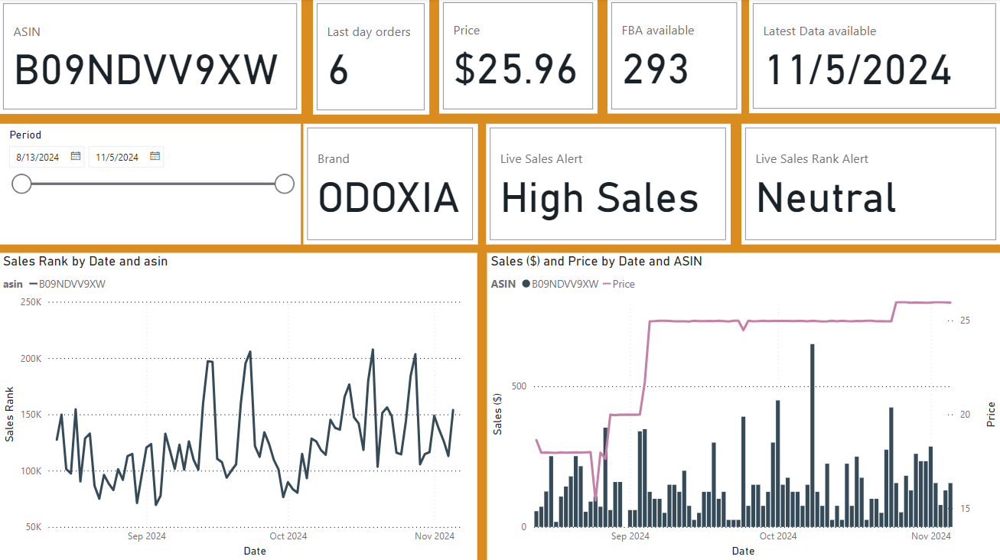
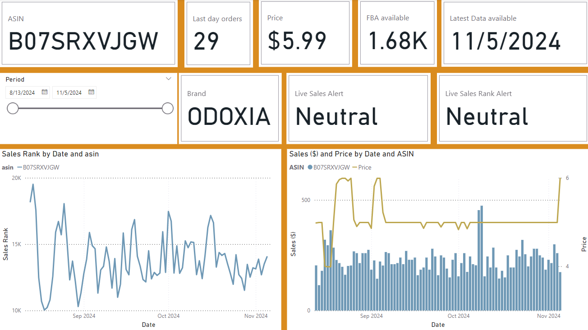
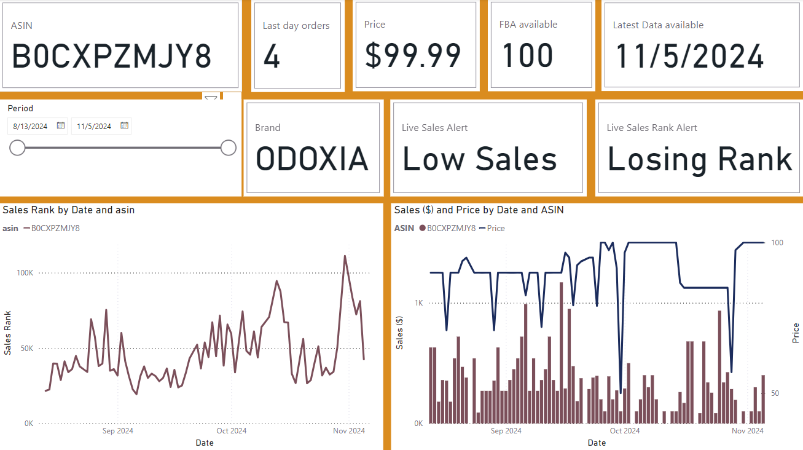

# E-commerce Data Dashboard and Performance Tracker Automation for Fulfilled by Amazon (FBA) Sellers        

## A complete project coded in Python, data stored in PostgreSql and dashboards created through PowerBI

This project is an example for FBA sellers to track performance of their products in more efficient and data driven way. Notebook contains sample code with sample data which shows how to do the following parts: 

* Gather and clean FBA data 
* Functions built for tracking Key Performance Indicator's (KPI) and Inventory status for products
* Creating database to store and Dashboarding 

In the end of this project you can reach out to example dashboards below with the choice of your interest in KPI's. 

1. A high selling product with no structural changes in Sales Rank

2. A neutral performing product

3. A bad performing Product

 

## How to run? 
Read the notebook for explanation of steps ,fill the "your directory" parts in the functions with example data paths respectively. If you'd like to run alert functions with different parameters you can always generate more data in example_data formats or use your own businesses data from Amazon seller central (source below). 

Once all steps are done you first run "pip install -r requirements.txt", then you can run the notebook "ipython e-commerce-automation.ipynb" locally on command prompt and extract the results with respect to run date.

## For own uses 
This is a sample project you can clone this repository and rename this project for own purposes. 

## Sources of reports 
You can reach out to reports in same structure through amazon seller central account -> business reports in reports tab for sales activities and sales rank, for inventory you can find through Inventory reports -> Amazon FBA Inventory section.  

## Found a bug? 
If you found an issue or would like to send an improvement, please submit an issue on the tab above. 

## Future Improvements 
The whole process is about saving time on automization of reports extracted from Amazon seller acounts. To speed up the collection of reports and data an API service provided by Amazon would improve the process with efficiency.